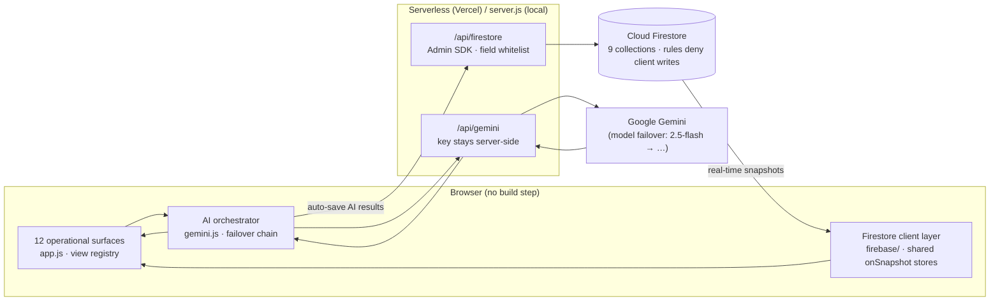

# ⚽ StadiumOS AI — AI Decision Intelligence for Mega-Events

**A live command-and-control platform for FIFA World Cup 2026 stadium operations.**
It doesn't just show dashboards — it *observes, predicts, explains, and recommends*, keeping a human in the loop for every consequential decision.

> **Live demo:** https://stadiumos-ai-five.vercel.app
> **Run locally:** `node server.js` → http://localhost:4517 (zero frontend build step).
> **Architecture deep-dive:** [docs/ARCHITECTURE.md](docs/ARCHITECTURE.md)

**Quality gates** — all enforced, all green:

| Gate | Status |
|---|---|
| Automated tests (`npm test`) | ✅ 59/59 — unit · contract · integration (real HTTP) · 25 accessibility checks |
| Lint (`npm run lint`) | ✅ 0 errors, 0 warnings (ESLint flat config; Prettier + EditorConfig) |
| Accessibility | ✅ WCAG 2.2 AA mechanics, **contrast ratios computed in CI** against the design tokens |
| Security | ✅ Zero client write capability; server-side key custody; per-collection field whitelists; rate limiting; deny-by-default rules |
| Runtime resilience | ✅ Deterministic fallback on every AI feature; global error boundary; offline cache |

---

## 1. Chosen Vertical

**Live operations & safety for mega-events** — the real-time "war room" that runs a stadium on match day.

A FIFA World Cup venue like MetLife Stadium moves ~82,000 people, 40%+ of them international, through gates, concourses, transit, and emergencies, all within a few hours. Today those decisions are made by humans staring at a wall of disconnected screens (CCTV, ticketing, transit, weather, radio). The single metric that decides whether a match day is safe or a disaster is **time-to-decision for a human under pressure** — a guard, a medic, a transport lead, an executive.

StadiumOS AI collapses that wall of screens into **one data model and one governed AI core**, and turns raw telemetry into *decisions with reasons attached*. The same platform generalizes to any mega-event: Olympics, concerts, marathons, airports.

---

## 2. Approach & Logic

The product is built on four architectural commitments:

**a) One data model, many surfaces.** A single live state object (`S` in `app.js`) — attendance, gates, 24 section densities, medical, power, water — is the *only* source of truth. Every view and every AI call reads from it (serialized by `stadiumContext()`), so the dashboards never disagree with the AI. For production, this is backed by a **Firebase Firestore real-time layer** (`firebase/`) — seven collections, snapshot listeners that update KPIs/charts/tables/notifications live with no page refresh, backend-only writes (Admin SDK), and secure rules. Gemini results auto-save into Firestore and stream to every connected client. It ships dormant (demo mode) until credentials are added — see **[SETUP-FIREBASE.md](SETUP-FIREBASE.md)**.

**b) AI as a decision engine, not a chatbot.** The flagship surfaces (**Stadium Brain**, **Predictive Mission Control**, **Emergency Intelligence**) all follow the same loop:
> **What is happening? → What will happen next? → Why? → What should we do? → What's the expected result?**
Every recommendation carries a **confidence score, risk level, expected improvement, and the alternatives it rejected** — explainable AI, not a black box.

**c) A governed AI orchestration layer.** All model access goes through `gemini.js` (`AI.call` / `AI.stream`), never directly. This layer provides:
- a **model failover chain** (`gemini-2.5-flash → flash-lite → 2.0-flash → 2.0-flash-lite`) that walks down on `429`/`503` to stay inside the free tier;
- **per-feature config flags** (`config.js`) — flip one flag and a feature reverts to its deterministic offline stub;
- **latency/token logging** to `ai_events`, visible in the AI Control Center;
- **JSON extraction + schema-shaped prompts** so model output is safe to render.

**d) Human-in-the-loop for anything consequential.** Evacuation plans, mass notifications, resource dispatch, and Emergency Mode all require a **named human sign-off** that is logged to an audit trail. No AI output reaches the public or moves a unit without approval.

---

## 3. How the Solution Works

### Architecture



**AI workflow:** every Gemini result flows *through* Firestore — the model writes via the backend (validated + timestamped), and the UI updates from the snapshot stream. One source of truth; every connected client sees the same state within milliseconds, with no page refresh.

**Frontend** — vanilla HTML/CSS/JS, no framework, no build step. `app.js` renders 12 operational surfaces from a view registry; `styles.css` is a locked design system (dark control-room theme, lime/teal accents). A simulated realtime loop drifts section densities every 3s and streams activity events every 12s so the board feels alive, while Firestore snapshot listeners repaint any surface the instant its data changes.

**API** — a thin Node proxy (`server.js` locally, `api/*.js` serverless functions on Vercel) that:
1. keeps the Gemini API key **server-side only** — the browser only ever talks to our own `/api/gemini`;
2. validates the model parameter against a whitelist (no path injection);
3. rate-limits to 30 calls/min per IP;
4. streams Server-Sent Events back for the typewriter chat.

**AI surfaces (40+ GenAI features), a sample:**

| Surface | What the AI does |
|---|---|
| **Stadium Brain** | One-cycle decision (situation → prediction → reason → recommendation → result) + confidence/risk scores, reasoning engine ("why is P3 full?"), spoken executive brief, scorecard, venue learning |
| **Mission Control** | "What-if" disaster simulator, predictive horizon (5/15/30 min), report trust-scoring, crowd emotion map, root-cause explorer, operational twin score |
| **Emergency** | One-click **Emergency Mode** digital commander, voice copilot, dynamic evac routes, medical triage engine, stampede prediction, responder optimizer, zone-targeted broadcast, family reunification, hospital coordination, auto-generated incident report |
| **Security** | Live crowd heatmap, threat action-orders, acoustic anomaly classification, multilingual safety broadcast, lost-person AI matching |
| **Fan App** | Crowd-aware wayfinding, seat delivery, multilingual assistant, personal exit planner, accessible & sensory-friendly routing |
| **Knowledge Graph** | Cross-domain reasoning — ask one question and the AI reasons *across* weather → crowd → transport → food → waste → operations, rendering the causal chain and the single move that breaks it (not module-by-module guesses) |
| **Fan Experience Score** | Live composite satisfaction score (navigation, food wait, accessibility, transport, safety) — the AI explains what's dragging it down and the one best fix |
| **Food Waste Predictor** | Pre-halftime forecast of unsold inventory per outlet with one-click transfer/discount actions — waste prevented before it exists |

**Command palette** — the top search bar (`Ctrl/⌘ + K`) searches pages, sections (with live density), incidents, people, and one-shot actions; anything unmatched falls back to *"Ask AI"*.

**Graceful degradation** — if Gemini is unreachable, every feature falls back to a deterministic stub. *The demo cannot die on stage.*

---

## 4. Assumptions Made

- **Sensor/CCTV/ticketing/transit feeds are simulated.** The realtime loop stands in for what would, in production, be live camera analytics, turnstile counts, and transit APIs. The *architecture* (one data model → AI context → decisions) is production-shaped; only the data source is mocked.
- **Actions are simulated with audit logging, not wired to hardware.** "Open Gate 5", "dispatch M-1", "send broadcast" record a signed, timestamped audit entry rather than actuating a real gate or PA — appropriate and safe for a demo.
- **Single venue** (MetLife Stadium) with one live match (MEX 1–0 RSA, 63'). Cross-stadium/mutual-aid features are modeled against plausible sibling venues.
- **Gemini free tier**, model named and approved in config; the failover chain and stubs exist precisely because free-tier quota is finite.
- **The deployed build is open-access** (no login) so judges can evaluate immediately. A MongoDB-backed auth layer with roles was prototyped separately and is not part of the public demo.
- Grounded features (weather, transit) assume Google Search grounding is available for that model.

---

## 5. Evaluation Focus Areas

### 🧱 Code Quality
- **Clear separation of concerns:** `config.js` (feature flags), `gemini.js` (AI orchestration), `app.js` (views + logic), `server.js`/`api/` (proxy). One data model, one AI entry point.
- **Readable, self-documenting patterns:** a view registry, small pure helper components (`kpi`, `qrow`, `brainBlock`), and consistent async feature functions (`busy()` → `AI.call` → render → `pushActivity`).
- **No framework lock-in, no build step, no transpile** — the whole app is inspectable as-is. ~2,000 lines, loads in well under 100 ms.

### 🔒 Security
- **API key never ships to the browser** — it lives only in an environment variable, read server-side by the proxy. The client only ever calls same-origin `/api/*`.
- **Input validation & isolation:** model names are whitelisted (`/^[a-z0-9.\-]+$/`), static file serving blocks path traversal, request bodies are size-capped.
- **Rate limiting** (30/min per IP) on the AI proxy to protect quota and prevent abuse.
- **XSS-safe rendering:** all model/user text passes through an escaping `md()` renderer before insertion; user input is escaped in chat.
- **Responsible AI governance:** human sign-off gates on evacuation/broadcast/dispatch, deterministic fallbacks, and no PII collected or stored.

### ⚡ Efficiency
- **Zero frontend dependencies** — no React/bundler tax; instant load, tiny payload.
- **Model failover chain** keeps calls inside the free tier instead of failing on quota.
- **SSE streaming** so the assistant renders tokens as they arrive (no full-payload waits).
- **Serverless functions** scale to zero and per-request on Vercel; the proxy is a stateless pass-through.
- Token/latency accounting per call surfaced in the AI Control Center.

### ✅ Testing / Validation

**Automated test suite — `npm test`** (Node's built-in `node:test` runner, zero test dependencies, **59 tests**; coverage report via `npm run test:coverage`):

| Layer | File | What it proves |
|---|---|---|
| **Unit — API validation** | `tests/api-firestore.test.js` | Method gating (405), unknown collection/op → 400, missing ids → 400, malformed JSON handled, per-IP rate limiting (429) |
| **Unit — security whitelist** | `tests/api-firestore.test.js` | `sanitize()` strips non-whitelisted fields (incl. injection attempts), timestamps can never be client-spoofed |
| **Unit — Gemini proxy** | `tests/api-gemini.test.js` | Missing key → 503, **path-injection in the model param rejected** (`../`, `?`, `&` …), valid model names pass |
| **Contract** | `tests/contracts.test.js` | Client collection registry ↔ backend schema never drift; seed docs conform to the whitelist; `firestore.rules` grants public read to exactly the public collections and **never** client writes |
| **Integration — real HTTP** | `tests/integration-server.test.js` | Boots `server.js` on a random port: health check, static serving with correct MIME, **path-traversal blocked**, API validation over the wire |
| **Accessibility (25 tests)** | `tests/accessibility.test.js` | Skip link ordering, labelled landmarks/dialogs/live-regions, every icon-only control labelled, focus-visible + reduced-motion + high-contrast CSS present, runtime a11y pass wired into navigation, and **computed WCAG AA contrast ratios on the actual design tokens** |

- **Deterministic fallbacks are the failure-mode harness:** disable a flag in `config.js` (or pull the key) and every feature verifiably degrades to a safe stub rather than breaking.
- **Manual validation matrix:** each AI surface driven end-to-end in-browser, failover chain observed handling live `429`s.

### ♿ Accessibility
- **WCAG mechanics:** skip-to-content link, `:focus-visible` indicators on all interactive elements, `prefers-reduced-motion` support (all animation disabled for users who ask), `prefers-contrast` high-contrast theme, ARIA labels on every icon-only control, `role="dialog"`/`aria-modal` on the assistant, `aria-live` regions for chat/toasts/**view-change announcements**, `role="search"` + labelled inputs, `aria-pressed` state on toggles, `aria-current="page"` navigation state, heading semantics (`aria-level` 1/2) stamped on every view, and charts exposed as labelled images. **Contrast is AA-verified in CI** — the test suite computes WCAG luminance ratios on the design tokens.
- **Inclusive by design, not as an afterthought:** the Fan App includes a **wheelchair / step-free routing mode** (elevators & ramps only, avoids dead elevators) and a **sensory-friendly mode** (routes around loud/bright/crowded zones).
- **Multilingual throughout** — assistant, announcements, and safety broadcasts render in EN/ES/FR/AR/PT; the fan assistant mirrors the user's language.
- **Voice input & output** — Web Speech API for hands-free commands and a spoken executive brief (screen-free operation).
- **Keyboard-first navigation** — `Ctrl/⌘+K` search, arrow-key/Enter/Esc control of the command palette, and keyboard-focusable nav with visible focus rings.
- **Fully responsive** — one codebase adapts from mobile → desktop (drawer nav, no horizontal overflow, scalable SVG); high-contrast dark theme.

---

## Deployment

Hosted on **Vercel** as a static frontend + serverless API functions
(`api/gemini.js`, `api/firestore.js`, `api/health.js`).

```bash
# one-time
npm i -g vercel      # or use npx vercel
vercel login

# deploy to production
vercel --prod

# server-side secrets (never commit these) — set once, then redeploy
vercel env add GEMINI_API_KEY production        # Gemini proxy
vercel env add FIREBASE_SERVICE_ACCOUNT production   # Firestore Admin writes
vercel --prod        # redeploy so the env vars take effect
```

`FIREBASE_SERVICE_ACCOUNT` is the full service-account JSON on one line (the
same value used in `.env` locally). Without it, the deployed `/api/firestore`
endpoint returns `503` and AI results won't persist. The **public** Firebase web
config lives in `firebase/firebase-config.public.js` and is committed — it's a
client identifier, not a secret (access is controlled by `firestore.rules`).

Local development:
```bash
node server.js       # http://localhost:4517  (reads GEMINI_API_KEY + FIREBASE_SERVICE_ACCOUNT from .env)
npm run seed         # optional: populate Firestore with demo docs
```

The `.env` file is git-ignored. **Rotate the Gemini key and the service-account
key after the event.** Full Firestore setup steps are in
[SETUP-FIREBASE.md](SETUP-FIREBASE.md).

## Real-time data layer (Firebase Firestore)

Firestore is the production source of truth (see `firebase/` + `SETUP-FIREBASE.md`):

- **9 collections** — `stadium_status`, `crowd_predictions`, `emergency_alerts`,
  `transport`, `sustainability`, `ai_reports`, `notifications`, `fan_experience`,
  `food_waste` (all typed in `firebase/types.ts`).
- **Live UI, no refresh** — `onSnapshot` listeners stream every change to KPIs,
  tables, and notifications. One shared listener per collection minimizes reads.
- **Backend-only writes** — clients read but never write. `firestore.rules` deny
  all client writes; the Admin SDK (`api/firestore.js`) is the single writer,
  keyed by the service account.
- **AI → Firestore auto-save** — Gemini results (crowd predictions, emergency
  recommendations, sustainability insights, incident summaries, transport advice,
  fan-experience scores, food-waste forecasts, and knowledge-graph reasoning)
  persist automatically and stream back to every connected dashboard.
- **Resilient** — offline cache (`persistentLocalCache`), online/offline
  handling, and a graceful demo mode when unconfigured.

## Folder structure

```
index.html · styles.css · app.js · gemini.js · config.js   # frontend (no build step)
server.js                                                   # local dev server
api/            gemini.js · firestore.js · health.js       # serverless functions
firebase/       config · service · hooks · live · types.ts # realtime data layer
tests/          59 tests (unit · contract · integration · a11y)
scripts/        seed-firestore.js
docs/           ARCHITECTURE.md (diagrams, AI pipeline, schema)
firestore.rules · firestore.indexes.json · firebase.json
```

## Future roadmap

- **Computer-vision ingestion** — replace simulated section densities with real CCTV crowd-counting feeds (the data model already accepts them).
- **Multi-venue federation** — the cross-stadium learning loop generalized to all 16 World Cup venues with a shared Firestore project per region.
- **Operator authentication & audit** — role-based access (operator / commander / read-only) with signed action logs for every human approval.
- **Native fan app** — the Fan App surface shipped as a PWA with push notifications for exit plans and zone alerts.
- **Model upgrades** — swap-in of Gemini structured-output mode (`responseSchema`) to eliminate JSON-parse fallbacks entirely.

## Stack
Vanilla HTML/CSS/JS · hand-rolled SVG charts & stadium model · Node serverless proxy · **Firebase Firestore (SDK v11 modular) real-time layer + Firebase Admin SDK backend writes** · Google Gemini via a governed orchestration layer with failover & deterministic fallbacks. No frontend build step.
