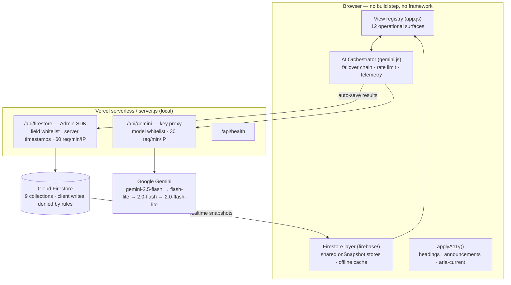

# StadiumOS AI — Architecture

> AI Decision Intelligence platform for FIFA World Cup 2026 stadium operations.
> This document covers the system architecture, the AI pipeline, the Firestore
> data model, and the engineering conventions that keep the codebase honest.

## 1. System overview



**Design principle — one data model, many surfaces.** A single live state
(`S` + Firestore) feeds every view *and* every AI prompt (via
`stadiumContext()`), so dashboards can never disagree with the AI.

**Design principle — the demo cannot die.** Every AI feature has a
deterministic fallback; a Gemini outage degrades features, never crashes a
surface. Every uncaught error routes to an operator toast + log.

## 2. AI pipeline

1. **Prompting** — every feature calls `AI.call(feature, prompt, opts)`;
   prompts request structured JSON with explicit shape contracts.
2. **Failover** — on `429`/`503` the orchestrator walks the model chain and
   benches exhausted models for 5 minutes; `thinkingBudget: 0` is applied to
   2.5-class (thinking) models so the output budget goes to answers.
3. **Parsing** — `extractJSON()` extracts and validates; malformed output
   triggers the feature's deterministic fallback, never a broken UI.
4. **Explainability contract** — decision-grade responses carry: situation,
   prediction, reasoning, confidence, risk, actions, expected impact, and
   alternatives considered (see the Agent Council's `decisionCard()`).
5. **Persistence** — results auto-save through `/api/firestore` (validated,
   server-timestamped) and stream back to every connected client.
6. **Telemetry** — each call logs feature, model, latency, tokens, and
   fallback status to the in-app `ai_events` table (AI Control Center).

### Multi-agent council
`conveneCouncil()` runs 7 specialist agents (crowd, security, medical,
transport, food, sustainability, accessibility) plus an Executive synthesizer
in **one structured call** — genuine multi-perspective deliberation (conflicts
are surfaced and resolved explicitly) without N× token cost.

## 3. Firestore data model

| Collection | Cardinality | Public read | Written by | Purpose |
|---|---|---|---|---|
| `stadium_status` | singleton (`metlife`) | ✅ | backend | headline venue telemetry |
| `crowd_predictions` | append | ✅ | backend (Gemini) | per-zone forecasts |
| `emergency_alerts` | append | ❌ sensitive | backend (Gemini) | incidents + AI recommendations |
| `transport` | singleton | ✅ | backend | egress / parking / transit |
| `sustainability` | singleton | ✅ | backend (Gemini) | ESG telemetry + AI suggestion |
| `ai_reports` | append | ✅ | backend (Gemini) | persisted AI outputs |
| `notifications` | append | ✅ | backend | operator notifications |
| `fan_experience` | singleton | ✅ | backend (Gemini) | live satisfaction score |
| `food_waste` | append | ✅ | backend (Gemini) | pre-halftime waste forecasts |

Types for every document live in [`firebase/types.ts`](../firebase/types.ts).
The registry (`firebase/collections.js`), the backend whitelist
(`api/firestore.js`), and `firestore.rules` are **contract-tested** against
each other (`tests/contracts.test.js`) so they cannot drift.

**Security model:** clients hold zero write capability — `firestore.rules`
denies all client writes; the Admin SDK (server-only credential) is the single
writer, and it whitelists fields per collection and stamps server timestamps.

## 4. Folder structure

```
├── index.html              # single page, semantic + ARIA landmarks
├── styles.css              # design system (tokens, a11y affordances)
├── app.js                  # view registry + features (browser, classic script)
├── gemini.js               # AI orchestrator (failover, telemetry, fallbacks)
├── config.js               # per-feature activation flags
├── server.js               # local dev server (mirrors Vercel routing)
├── api/                    # serverless functions (Vercel)
│   ├── gemini.js           #   Gemini key proxy
│   ├── firestore.js        #   Admin-SDK write endpoint (single writer)
│   └── health.js           #   health check
├── firebase/               # client data layer (ES modules)
│   ├── firebase-config.js  #   SDK init + offline cache
│   ├── firestore-service.js#   get/subscribe/add/update/delete
│   ├── use-firestore.js    #   shared listener stores ("hooks")
│   ├── firestore-live.js   #   boots listeners, live KPIs, AI auto-save
│   ├── collections.js      #   collection registry + classification
│   └── types.ts            #   TypeScript contracts for all documents
├── tests/                  # 59 tests: unit · contract · integration · a11y
├── scripts/seed-firestore.js
├── firestore.rules         # deny-by-default security rules
└── docs/ARCHITECTURE.md    # this document
```

## 5. Engineering conventions

- **Correctness-first linting** — `npm run lint` (ESLint flat config, zero
  errors/warnings); formatting via Prettier (`.prettierrc`, `.editorconfig`).
- **Tests are contracts** — `npm test` (59 tests) gates schema drift, security
  whitelists, WCAG contrast ratios, and real-HTTP behavior. Coverage:
  `npm run test:coverage`.
- **No client secrets** — Gemini key and the Firebase service account exist
  only in server env; the browser talks exclusively to first-party APIs.
- **Accessibility is enforced, not aspirational** — 25 automated checks fail
  the build if an affordance regresses; `applyA11y()` stamps semantics on
  every navigation.
